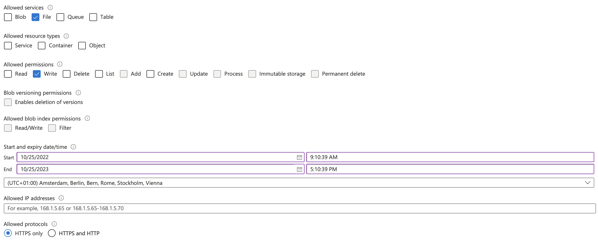

# SOAR Playbook - Aftermath Collection

This SOAR playbook is provided to collect the output from an Aftermath Scan and upload it to Azure Files storage.

## About Aftermath

Aftermath is a Swift-based, open-source incident response framework, available on Jamf's open source GitHub repository (https://github.com/jamf/aftermath).

Aftermath can be leveraged by defenders in order to collect and subsequently analyze the data from the compromised host. When deploying Aftermath via Jamf Pro, this script can be used in tandem with an Aftermath first run, ensuring the data is securely stored in a designated Azure File Share once an Aftermath collection is complete.

## Workflow Steps

Steps to create the workflow:

- [ ] Jamf Pro - Upload [Aftermath.pkg](https://github.com/jamf/aftermath/releases) and deploy to endpoints
- [ ] Create [aws_aftermath.pkg](#aws_pkg) and upload to Jamf Pro 
- [ ] Jamf Protect - Analytics Smart Group Identifier configured
- [ ] Jamf Pro - Create a Smart Group populated by `Jamf Protect - Smart Groups` [Extension Attribute](https://docs.jamf.com/jamf-protect/documentation/Setting_Up_Analytic_Remediation_With_Jamf_Pro.html#task-7832) 
- [ ] Jamf Pro - Upload [aftermath_collection.sh](./aftermath_collection.sh)
    - Set the variables in the script
- [ ] Jamf Pro - [Create Policies](#policies)
    - Aftermath Scan
    - Aftermath Collect

## Workflow Components
### Jamf Protect

Each Analytic must have the Add to Smart Group feature enabled. 

- Add to Jamf Pro Smart Group: **Checked**
    - Identifier: **aftermath**

### Jamf Pro
#### Smart Computer Group

|Display Name|Criteria|Operator|Value|
|------------|--------|--------|-----|
|Jamf Protect: Aftermath|Jamf Protect - Smart Groups|like|aftermath

####  Policies

|Name|Frequency|Trigger|Scope|Payload|
|----|---------|-------|-----|-------|
|**Aftermath Scan**|Ongoing|protect|Jamf Protect: Aftermath|`/usr/local/bin/aftermath --pretty; /usr/local/bin/jamf policy -event am_collect`
|**Aftermath Collect**|Ongoing|am_collect|All Managed Clients|aftermath_collection.sh Add `SAS Token` in script Parameter 4

**Azure Files Configuration**

- Create [Azure File Share](https://learn.microsoft.com/en-us/azure/storage/files/storage-files-introduction) and generate an [SAS Token](https://learn.microsoft.com/en-us/rest/api/storageservices/delegate-access-with-shared-access-signature) with `write-only` permissions as applied in the example below.

#
## Please note that all resources contained within this repository are provided as-is and are not officially supported by Jamf Support.