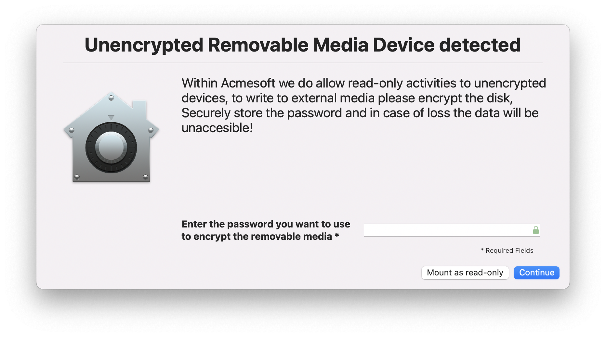
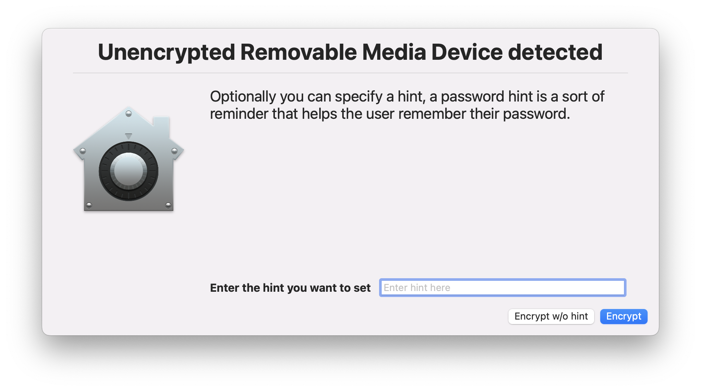
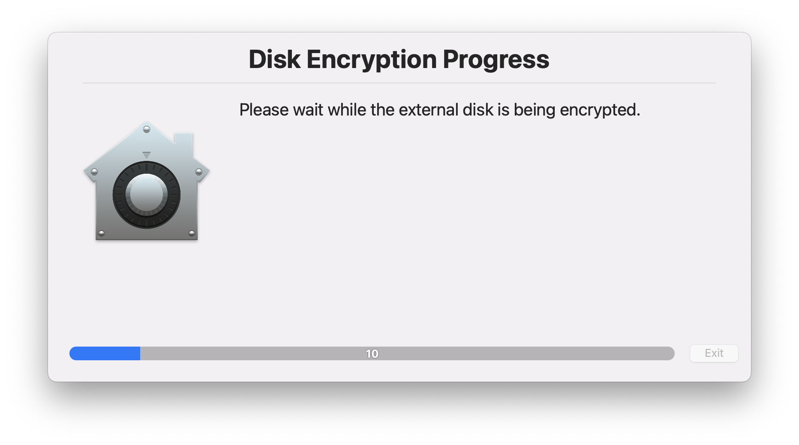
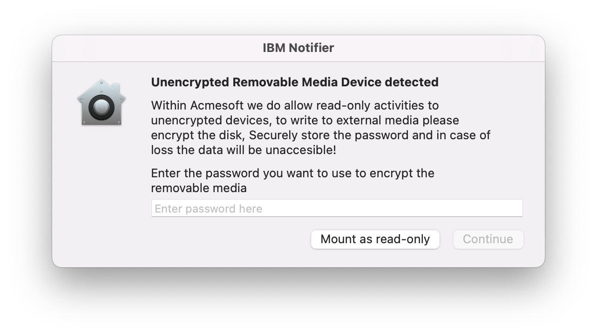
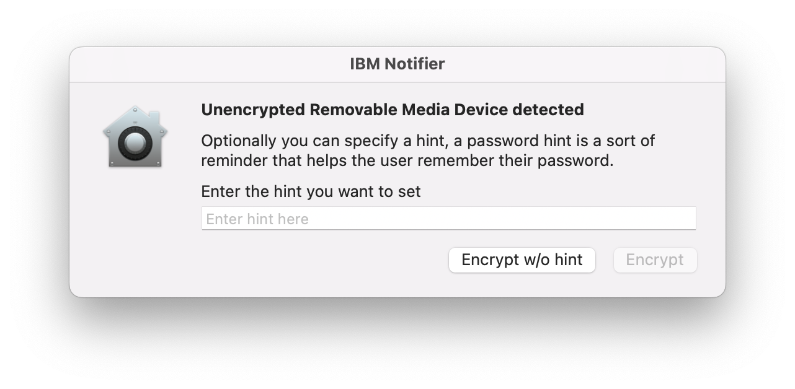
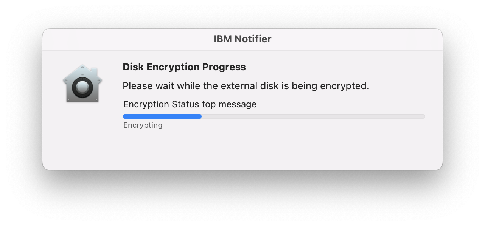

# SOAR Playbook - Physical Removable Media Disk Encryption

This playbook provides a workflow between Jamf Protect and Jamf Pro to monitor `USBInserted` events using Analytics and once detected that the encryption state of a removable media device is unencrypted the end user will be prompted with notifications to encrypt it on-demand or have it mounted as read-only and preventing write activities to those removable devices.

*Currently this workflow can’t be used alongside with having Device Controls set by Jamf Protect*

Please read through and test this script intensively prior adding it to your production environment, as in some cases the end-user agree's to erase the external disk and losing it's contents stored on it. 

## Dependencies
This reposository contains two scripts, one developed to work with swiftDialog and the other to work with IBMNotifier.

- [ ] SwiftDialog (https://github.com/bartreardon/swiftDialog/releases)
    -  swiftDialog includes options to enforce a password and hint complexity requirements based on a REGEX string 
- [ ] IBMNotifier (https://github.com/IBM/mac-ibm-notifications/releases)

## Workflow Steps

Steps to create the workflow:

- [ ] Jamf Pro - Distribute swiftDialog or IBMNotifier to the managed macOS endpoints
- [ ] Jamf Protect - Enable `USBInserted` Analytic in a Plan and set a custom identifier like usbinserted
- [ ] Jamf Pro - Create a Smart Group populated by `Jamf Protect - Smart Groups` [Extension Attribute](https://docs.jamf.com/jamf-protect/documentation/Setting_Up_Analytic_Remediation_With_Jamf_Pro.html#task-7832)
- [ ] Jamf Pro - Upload  either [RemovableMediaDiskEncryption_swiftDialog.sh](./RemovableMediaDiskEncryption_swiftDialog.sh) or [RemovableMediaDiskEncryption_IBMNotifier.sh](./RemovableMediaDiskEncryption_IBMNotifier.sh)
- [ ] Jamf Pro - [Create Policies](#policies)
    - Jamf Protect: Encrypt unencrypted devices

## Workflow Components
### Jamf Protect

The Analytic must have the Add to Smart Group feature enabled. 

- Add to Jamf Pro Smart Group: **Checked**
    - Identifier: **usbinserted**

### Jamf Pro
#### Smart Computer Group

|Display Name|Criteria|Operator|Value|
|------------|--------|--------|-----|
|Jamf Protect: USBInserted|Jamf Protect - Smart Groups|like|usbinserted

####  Policies

|Name|Frequency|Trigger|Scope|Payload|
|----|---------|-------|-----|-------|
|**Jamf Protect: Encrypt unencrypted devices**|Ongoing|protect|Jamf Protect: USBInserted|Script: RemovableMediaDiskEncryption_swiftDialog.sh  Maintenance: Update Inventory enabled

####  Screenshots

##### swiftDialog

 

##### IBM Notifier

 

#
## Please note that all resources contained within this repository are provided as-is and are not officially supported by Jamf Support.
