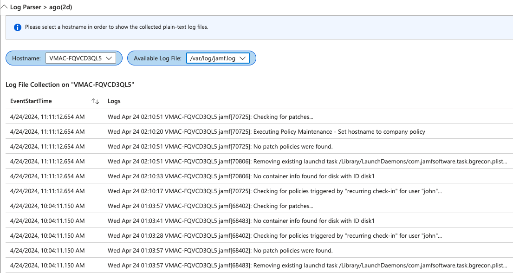
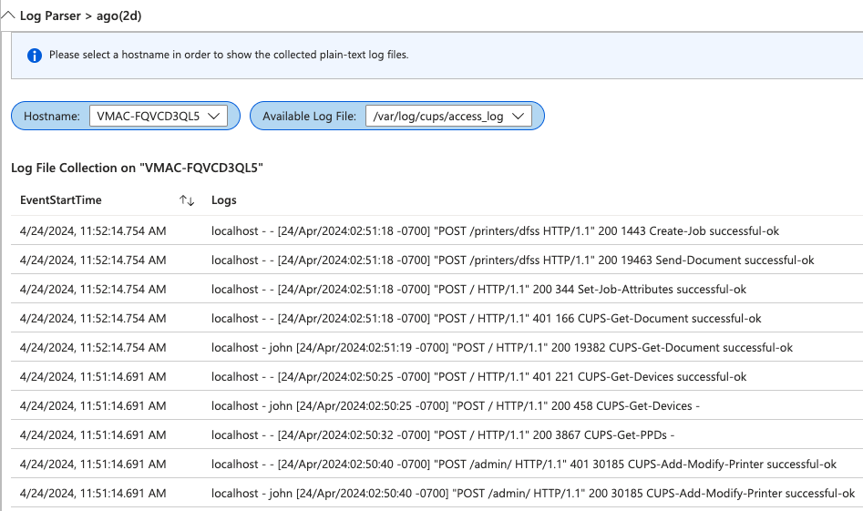

# Simple Log File Collection

In this repository, you will find examples of log file paths that Jamf Protect can collect. These logs are useful for troubleshooting or can be archived for further analysis.

Telemetry in Jamf Protect offers an optional feature to begin monitoring and collecting entries from specific simple log files as soon as telemetry is enabled. Upon activation, Jamf Protect gathers all specified log files and then continuously streams any new entries to your Security Information and Event Monitoring (SIEM) solution every minute.

**_Configured log files should adhere to the format where entries are separated by a new line._**

You can find documentation on Jamf Protect Telemetry [here](https://learn.jamf.com/en-US/bundle/jamf-protect-documentation/page/Telemetry.html).

| Log file path | Description     | Type  | Vendor  | Links        |
|---------------|-----------------|---------|---------|-------------|
| /private/var/log/jamf.log | Contains log messages written by the `jamf` binary, useful for monitoring or troubleshooting `jamf` binary activity. | 3rd party   | Jamf Software   | [Jamf Learn Hub](https://learn.jamf.com/en-US/bundle/jamf-pro-documentation-current/page/Components_Installed_on_Managed_Computers.html#d25090e329)
| /private/tmp/jamf_login.log | Contains the most recent logs on the computer, excluding debugging logs related to `Jamf Connect`. | 3rd party   | Jamf Software   | [Jamf Learn Hub](https://learn.jamf.com/en-US/bundle/jamf-pro-documentation-current/page/Components_Installed_on_Managed_Computers.html#d25090e329)
| /private/var/log/install.log | Contains a step by step account of exactly what took place during each installation and update either `Mac App Store` apps or software using an `Installer` package. | macOS   | Apple |
| /private/var/log/system.log | Provides a record of system-wide events and messages from the operating system and applications, useful for troubleshooting and monitoring system activity. | macOS   | Apple |
| /var/log/cups/access_log | Contains access_log to track requests that are submitted to the CUPS scheduler | macOS   | Apple | [cups.org](https://www.cups.org/doc/man-cupsd-logs.html)
| /private/var/log/Installomator.log | Provides a record of INFO or DEBUG messages generated by Installomator, useful for troubleshooting issues or monitoring Installomator activity | 3rd party   | Open-Source | [Installomator GitHub](https://github.com/Installomator/Installomator/blob/main/Installomator.sh#L423)

#### Images

These screenshots illustrate an example of how log file collection can be effectively utilized within a Security Information and Event Monitoring (SIEM) system.

**Disclaimer:** All resources contained in this repository are provided as-is and are not officially supported by Jamf Support