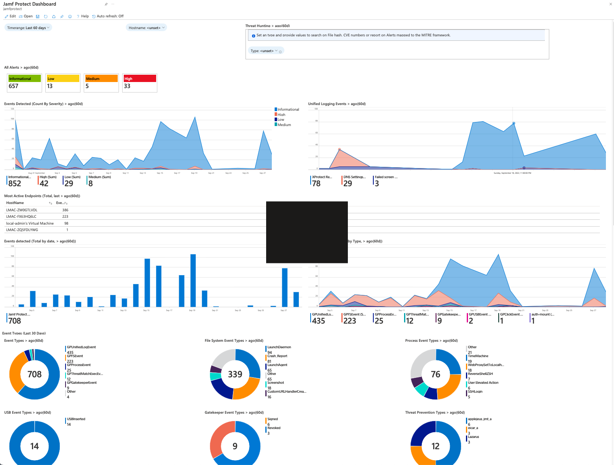
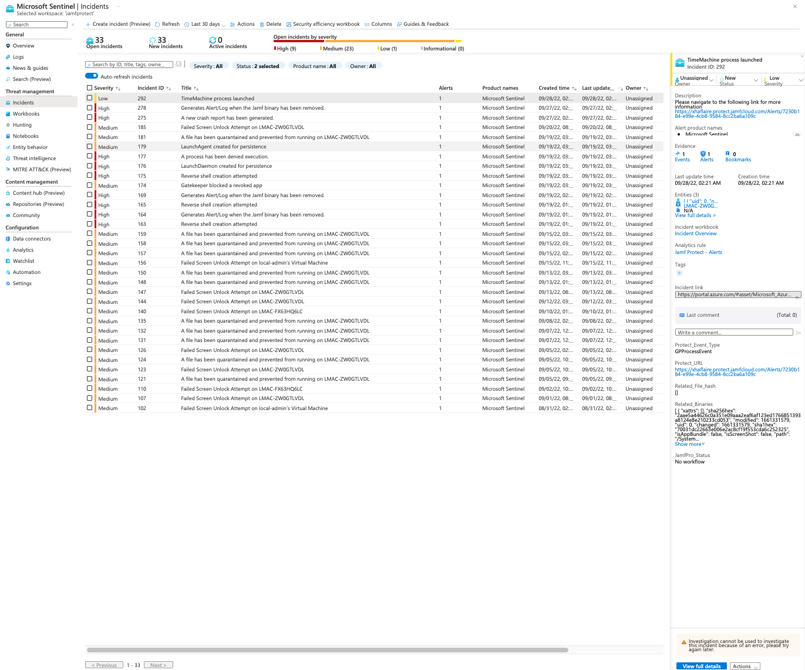

# Microsoft Sentinel
The files contained in this repository provides example workbooks and queries for Microsoft Sentinel with having Jamf Protect as data source.

**Microsoft Sentinel: Workbooks:**

Recently we have published **Jamf Protect for Microsoft Sentinel** solution in the Azure Marketplace and Microsoft Sentinel Content Hub.

The Jamf Protect for Microsoft Sentinel solution creates detailed event data from macOS endpoints into a Microsoft Sentinel workspace in a simple and easy workflow. The solution provides you with full visibility into Apple Endpoint Security by leveraging Workbooks containing Alert and Unified Logging events captured by Jamf Protect and the macOS built-in security events that occurred across the protected organisational endpoints.

Navigate to the [Jamf Protect for Microsoft Sentinel](https://azuremarketplace.microsoft.com/en-gb/marketplace/apps/jamfsoftwareaustraliaptyltd1620360395539.jamf_protect?tab=Overview) Azure Marketplace listing to find out more!

**Microsoft Sentinel: Analytics**

*Steps to use example Analytics contained within this repository:*

1. Open the .json file with your preferred text editor and find and replace jamfprotect_CL with your custom Log Type Name. (You can find the Log Type Name in Jamf Protect -> Administrative -> Data -> Microsoft Sentinel -> Log Type) and save the file. 
2. Navigate to _https://portal.azure.com_
3. Navigate to Microsoft Sentinel
4. Navigate to the Sentinel Workspace that is being used for Jamf Protect
5. Navigate to Analytics
6. Click on the import button in the top menu bar
7. Select the Analytic .JSON file you want to import and click Upload

**Disclaimer:** All resources contained in this repository are provided as-is and are not officially supported by Jamf Support.
